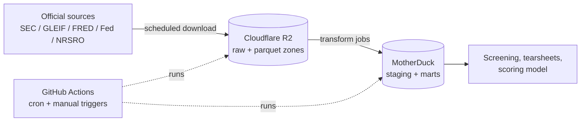

# Architecture (tracker A6)

## Plain-language version

Think of the platform as three rooms connected by a conveyor belt, none of them in our house:

1. **Warehouse loading dock — Cloudflare R2.** Big files arrive from official sources
   (SEC, GLEIF, Fed, …) and are kept exactly as received, dated, so we can always go back.
2. **Workshop — GitHub Actions.** Scheduled cloud machines wake up, take raw files from the
   dock, clean and reshape them, and put the results on shelves. The machines are destroyed
   after each job — nothing lingers.
3. **Showroom — MotherDuck.** The cleaned, query-ready tables analysts and the scoring model
   actually use. This is the only place we "shop" from.

The owner's laptop never stores any of it; it just presses the buttons.

## Technical version

- **Zones (medallion):** `raw` (as received, verbatim columns) → `staging` (typed, deduped,
  point-in-time vintage flags) → `marts` (spread templates, ratios, benchmarks, events).
  Side schemas: `ref` (master data), `quali` (text corpus indexes), `events` (event feeds).
- **Storage layout on R2:** `raw/sec/<dataset>/period=
/<original>.zip` keeps the
  untouched archive for audit; `parquet/sec/<dataset>/<table>/period=
/data.parquet`
  holds the columnar copy the warehouse reads.
- **Lake-first serving.** Heavy fact tables (`num`, `txt`, `pre`, `cal`, `ren`, `dim`, the
  filing index) stay as parquet in R2 and are exposed through MotherDuck *views*, so
  warehouse storage stays inside the free tier and R2 costs pennies per GB. Small,
  heavily joined tables (filing headers, tag dictionary, entity master) are materialised
  for speed. `warehouse/build_views.py` owns that split and is safe to re-run.
- **Raw fidelity:** every bulk column is stored as text exactly as the SEC published it;
  casting happens in `staging.*_typed` views. Loaders never silently coerce.
- **Naming:** snake_case everywhere; `_a`/`_q` suffixes for annual/quarterly grains;
  every mart column documented in the data dictionary (tracker A7).
- **Point-in-time discipline (M3):** keep first-reported and latest-restated values keyed by
  accession vintage; models train on first-reported only.

## Why these platforms (decisions DEC-1/2/3, closed 2026-08-05)

| Piece | Choice | Why |
|---|---|---|
| Warehouse | MotherDuck (free tier) | Cloud DuckDB — reads parquet on R2 natively; zero server admin; SQL from anywhere |
| Raw storage | Cloudflare R2 (free 10 GB, cheap beyond) | S3-compatible; zero egress fees, which matters when the warehouse re-reads raw files |
| Compute | GitHub Actions (free minutes) | Jobs live next to the code; cron + manual triggers; logs and email alerts built in |

All three run comfortably at prototype scale for $0/month; each has a clean upgrade path.
